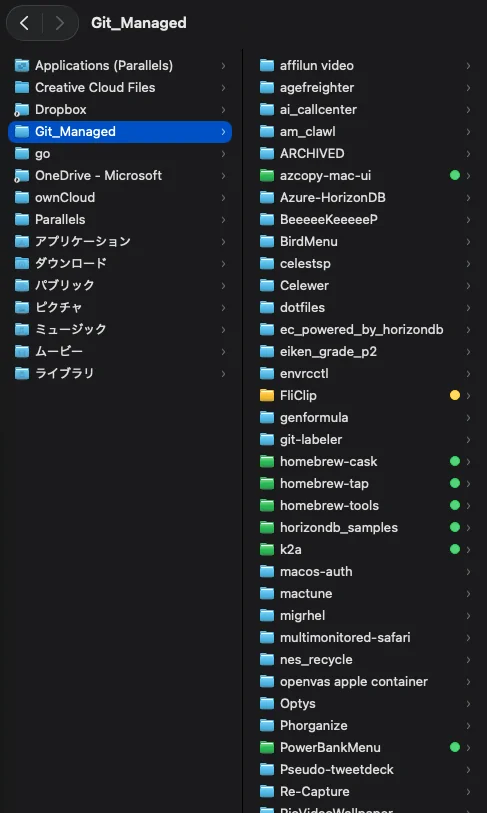

# git-labeler

`git-labeler` applies macOS Finder tags to direct child git repositories under configured parent directories.

It is designed for Apple Silicon macOS and maps repository status to Finder labels:

- `git:untracked` / green: untracked files exist and no higher-priority state exists
- `git:modified` / yellow: modified, added, renamed, copied, type-changed, or conflicted paths exist
- `git:deleted` / red: deleted paths exist
- clean: managed `git:*` tags are removed

Directories that are not git repository roots are ignored and their Finder tags are not changed.



## Installation

Install from the Homebrew tap:

```sh
brew tap rioriost/cask
brew install --cask git-labeler
```

Configure at least one parent directory:

```sh
git-labeler config add ~/Git_Managed
```

Start the LaunchAgent:

```sh
/opt/homebrew/share/git-labeler/scripts/install-launchagent.sh
```

The package installs an Apple Silicon binary under `/opt/homebrew/bin/git-labeler`.

## Usage

```sh
git-labeler config add ~/Git_Managed
git-labeler config list
git-labeler scan
git-labeler config remove ~/Git_Managed --clear-labels
```

Remove a configured parent directory while keeping existing Finder tags:

```sh
git-labeler config remove ~/Git_Managed
```

Remove a configured parent directory and clear labels previously managed by `git-labeler` from git repositories directly under that directory:

```sh
git-labeler config remove ~/Git_Managed --clear-labels
```

Check the LaunchAgent status:

```sh
/opt/homebrew/share/git-labeler/scripts/status-launchagent.sh
```

Restart the LaunchAgent after changing configuration:

```sh
/opt/homebrew/share/git-labeler/scripts/uninstall-launchagent.sh
/opt/homebrew/share/git-labeler/scripts/install-launchagent.sh
```

`git-labeler` is distributed as a notarized Homebrew Cask package, not as a Formula, so it is not managed by `brew services`.

The config file is stored at:

```text
~/Library/Application Support/st.rio.git-labeler/config.json
```

## Configuration

```json
{
  "version": 1,
  "roots": [
    "/Users/rifujita/Git_Managed"
  ],
  "debounceMilliseconds": 750,
  "rescanIntervalSeconds": 300,
  "gitPath": null,
  "tags": {
    "untracked": "git:untracked",
    "modified": "git:modified",
    "deleted": "git:deleted"
  }
}
```

Multiple roots are supported. The daemon watches each root with FSEvents, debounces changes per repository, and periodically rescans all configured roots.

## Development

```sh
swift test
swift build -c release --arch arm64
```

## macOS Release

Create the notary profile once with an app-specific password:

```sh
xcrun notarytool store-credentials git-labeler-notary \
  --apple-id APPLE_ID \
  --team-id TEAMID \
  --password APP_SPECIFIC_PASSWORD
```

Build a signed package:

```sh
make package-macos-signed \
  CODESIGN_IDENTITY="Developer ID Application: YOUR NAME (TEAMID)" \
  PKG_SIGN_IDENTITY="Developer ID Installer: YOUR NAME (TEAMID)"
```

Notarize and staple it:

```sh
make notarize-macos NOTARY_PROFILE=git-labeler-notary
```

The cask artifact is:

```text
target/package/macos/git-labeler-0.1.5-darwin-arm64.pkg
```

Update `Casks/git-labeler.rb` with the SHA-256 written to `target/package/macos/SHA256SUMS.cask`.

## License

MIT
